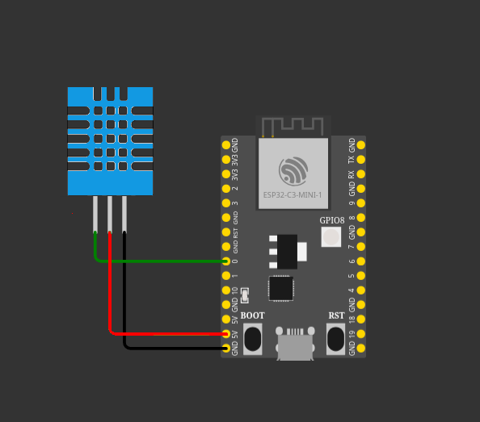

# About

This project consists in a Rust (no_std) driver for DHT11 temperature and humidity sensor, using Embassy framework.
The example runs on an ESP32-C3 microcontroller.

# Wiring

# How to launch

Make sure [Rust](https://www.rust-lang.org/tools/install) is installed.

Set the target:
~~~
rustup target add riscv32imc-unknown-none-elf
~~~

Install libudev-dev
~~~
sudo apt install libudev-dev
~~~

Install `espflash` to be able to flash the binary to ESP32 device:
~~~
cargo install espflash
~~~

Then you can run the project:
~~~
cargo run --release
~~~